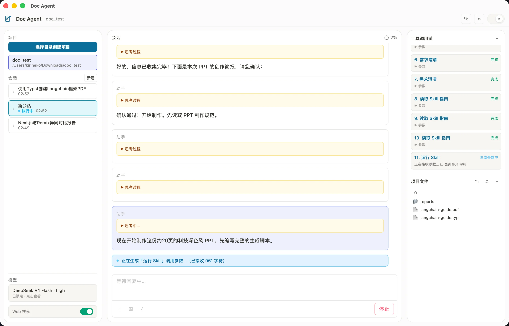

# Doc Agent

面向办公场景的本地 AI 助手。以**项目文件夹**为工作边界，在 Word、Excel、PPT、PDF 等文档上通过对话完成阅读、分析、改写与生成。数据与 API Key 均保存在本机，文档文件不离开你选择的目录。

**文档站点**：[docs.kirineko.tech](https://docs.kirineko.tech/) — 安装指南、功能说明与使用场景

**技术栈**：Tauri 2 · Rust · React

**支持平台**：Windows（x86_64）· macOS（Apple Silicon / aarch64）



---

## 主要功能

### 项目与会话

- 选择一个本地文件夹作为**项目**，Agent 只能在该目录内读写文件
- 每个项目可创建多个**独立会话**，历史消息与工具调用记录持久化保存
- **并行执行**：应用内最多 **3 个会话**同时 running（可跨项目）；写同一文件时自动互斥并提示占用
- 左侧栏管理项目列表（可隐藏项目）、会话列表，以及当前模型摘要；侧栏左下打开**模型 Flyout** 切换 Provider / 模型 / 思考配置
- 顶栏「**密钥与服务**」Drawer 集中配置 DeepSeek / Kimi / MiMo / Tavily API Key；侧栏可开关 Web 搜索（需 Tavily Key）
- 新建会话默认沿用上次选择的模型与思考配置（无记录时为 DeepSeek V4 Flash + 思考 + high）
- **项目级 AGENTS.md**：项目根可放置 `AGENTS.md` 作为 Agent 配置；`/init` 斜杠命令引导生成或更新；Chat 区显示配置加载状态

### 对话与界面

- **三栏布局**：左侧配置 · 中间对话 · 右侧工具调用链 / 构建产物 / 项目文件（上下分栏可拖拽，比例持久化）
- **构建产物 Tab**：按 turn 累积本轮 Agent 写入的文件与目录，支持打开与在文件管理器中定位；过滤 `.cache/` 中间产物
- **明暗主题**：顶栏切换深色 / 浅色，偏好本地持久化
- 流式 Markdown 渲染（代码高亮、表格、公式）
- 模型**思考过程**默认折叠，点击可展开
- 多轮工具调用时，每一步 assistant 回复独立展示，不会混在同一流式框中
- **输入工具栏**：底栏 **+**（导入文件到项目根）、**图片**（附件）、**/**（斜杠命令图形菜单）；`/` 键盘弹层与图形菜单并存
- **斜杠命令**：内置 general / Word / PPT / Excel / PDF / Web 任务模板（如 `word:edit`、`ppt:edit-ooxml`、`/compact`）；填入 prompt 并选中占位符，不自动发送
- 输入框支持 `@` **引用项目内文件**（模糊搜索、分层浏览）；Agent 改文件后浏览区与 `@` 列表自动同步
- **图片输入**：vision 模型下可粘贴或选择图片（PNG / JPEG / WebP / GIF），支持仅发图无文字；历史消息展示缩略图，点击可放大预览
- **停止按钮**：Agent 执行中可停止当前 turn（stopping 态等待当前工具结束）
- **上下文占用**：会话标题栏始终显示占用比例（空会话为 0%）；接近上限时自动压缩；`/compact` 可手动触发压缩
- **智能推荐问**（需配置 DeepSeek Key）：空会话生成 3–4 条起步问题；每轮对话结束后生成 2–3 条 follow-up，点击填入输入框
- **需求澄清**：模糊需求时 Agent 可通过 `clarify_ask` 暂停并收集结构化回答，确认后再继续；与 `AGENTS.md` 协作避免重复提问
- **回合结束自动聚焦**：turn 结束或切换会话后 Chat 输入框自动聚焦（抽屉/弹层打开时不抢焦点）

### 支持的模型

| 模型 | 提供商 | 视觉 | 思考模式 | 思考强度 |
|------|--------|------|----------|----------|
| DeepSeek V4 Flash | DeepSeek | — | 可开关 | high / max |
| DeepSeek V4 Pro | DeepSeek | — | 可开关 | high / max |
| Kimi K2.6 | Kimi | ✓ | 可开关 | — |
| MiMo v2.5 | MiMo | ✓ | 可开关 | — |
| MiMo v2.5 Pro | MiMo | — | 可开关 | — |
| MiMo v2.5 Pro Ultraspeed | MiMo | — | 可开关 | — |

在顶栏打开「**密钥与服务**」配置各 Provider API Key；在侧栏 Model Flyout 选择模型。可选配置 **Tavily** Key 并在侧栏开启 Web 搜索。

### 文档与工具能力

Agent 通过工具链操作项目内文件，主要包括：

| 类别 | 能力 |
|------|------|
| 文件 | 列出 / 读取 / 写入 / 补丁 / 搜索；右侧栏浏览项目内文件 |
| 图片 | 用户粘贴多模态输入；vision 模型可用 `image_read` 读取项目内图片；**`image_download`** 批量下载公网图片到项目目录（默认 `images/`）供文档引用 |
| Office 读取 | 将 Word / Excel / PPT / PDF 等转为 Markdown 供模型理解 |
| 旧版 Office | `office_convert` 转换 `.doc` / `.xls` / `.ppt`；`.xls` 可直接 SQL 分析 |
| Word | `skill_run` + docx-js 创建与编辑 `.docx`（OOXML 解包 / 回包） |
| Excel | 读取 / 写入；`excel_describe` / `excel_normalize` 清洗不规则表 |
| PPT | `skill_run` + pptxgenjs；或斜杠 `ppt:edit-ooxml` 精准改 OOXML |
| PDF | 合并、拆分、旋转、删除页面；`pdf_read` 智能读（文本 / vision） |
| HTML 报告 | 项目内静态 HTML 报告；可选 `html_to_pdf` 导出 PDF |
| Typst | `typst_to_pdf` 离线编译 `.typ` 为 PDF；内置中英 report/exam/paper/lecture 模板与语法手册；捆绑 Noto SC 字体保证中文无警告回退 |
| OOXML | 解包 / 打包（含结构校验）、批注、接受修订 |
| 数据分析 | Word 表格提取、`polars-sql` 查询、IronCalc 重算公式 |
| 联网（可选） | Tavily `web_search` / `web_extract`（侧栏开关 + Key） |
| Document Skills | 内置 docx / pdf / pptx / xlsx / html-report / clarify / runtime；`skill_read` + `skill_run`（exceljs、docx、pptxgenjs、pdf-lib） |

所有文件操作受**沙箱**约束，路径不能逃出项目根目录。网络图片须先 `image_download` 落地，再在文档工具中按本地路径引用。

---

## 数据存储

应用数据统一保存在系统应用数据目录（与安装包位置无关）：

| 内容 | macOS | Windows |
|------|-------|---------|
| 会话 / 项目元数据（SQLite） | `~/Library/Application Support/com.kirineko.doc-agent/doc_agent.db` | `%APPDATA%\com.kirineko.doc-agent\doc_agent.db` |
| API Key（`config.toml`） | 同上目录 | 同上目录 |
| **文档文件** | 创建项目时选择的文件夹 | 同左 |

项目内 Agent 缓存（附件、skill-run 脚本、PDF 渲染页等）统一在 **`.cache/`** 下，不出现在文件浏览与 `@` 列表中。

---

## 安装

版本变更见 [CHANGELOG.md](./CHANGELOG.md)。

请从 [GitHub Releases](https://github.com/kirineko/doc_agent/releases) 下载对应平台的安装包（macOS：`.dmg`；Windows：NSIS `*-setup.exe`）。Release 说明中提供阿里云 OSS 下载链接。

### 自动更新

从 **1.0.0** 起，应用支持应用内自动更新（启动时检查 + 设置抽屉「更新」）。**1.0.0 之前**的版本不含 updater，需手动安装 1.0.0 基线包。

> 暂不提供 Linux 安装包。

---

## 快速开始

详细图文步骤见 [文档站 · 新手配置](https://docs.kirineko.tech/#setup)。

1. 安装并启动 Doc Agent
2. 在左侧点击添加项目，选择你的工作文件夹
3. 在顶栏打开「**密钥与服务**」，配置 **DeepSeek**、**Kimi** 和 / 或 **MiMo** 的 API Key
4. 在侧栏 Model Flyout 选择模型（需识图时选 Kimi K2.6 或 MiMo v2.5），新建会话即可开始对话
5. 尝试：「列出目录里的 docx 文件」「总结 @某文件.docx 的要点」「把这几张网络图片下载到 images/ 再插入 Word」

**快捷键**：`Enter` 发送 · `Shift+Enter` 换行 · `@` 引用文件 · `/` 斜杠命令 · 粘贴图片（vision 模型）

---

## 从源码构建

**环境要求**：Node.js 22+ · Rust stable · 各平台 Tauri 前置依赖（见 [Tauri 文档](https://v2.tauri.app/start/prerequisites/)）

```bash
npm ci
npm run bundle:js    # 打包 skill 运行时 JS 库（构建前必须执行）
npm run tauri dev    # 开发模式
```

首次 Rust 编译会通过 `build.rs` 自动下载 **PDFium** 与 **Noto SC 字体**（约 40 MB，缓存于 `src-tauri/fonts/`，已 gitignore）。需联网；离线复用需保留该目录。

**测试**

```bash
cd src-tauri && cargo fmt --check && cargo clippy -- -D warnings && cargo test
npm run typecheck && npm test
```

**本地打 release 包**

```bash
npm run bundle:js
npm run tauri build
```

---

## 发版说明（维护者）

- **CI**：仅 `pull_request → main` 触发测试门禁；push main **不**触发构建；缓存 `src-tauri/fonts/` 以减少 Noto 重复下载
- **Release**：推送纯数字三段 CalVer tag（`YYYY.M.D`，**无 `v` 前缀**）时触发 Windows（NSIS）/ macOS（DMG）安装包构建，产物上传 **阿里云 OSS** 并同步 **GitHub Release**（Windows 不产出 MSI：CalVer 与 WiX major ≤255 不兼容）
- **版本格式（CalVer）**：**`YYYY.M.D`**（年.月.日），**禁止前导零** — 例：`2026.6.14`（✅）、`2026.06.14`（❌）
- **取当日版本**：`npm run calver:today`
- **发版前**：`package.json`、`src-tauri/Cargo.toml`、`src-tauri/tauri.conf.json` 的 `version` 与 tag 完全一致；更新 `CHANGELOG.md`（`[Unreleased]` → 正式版本节）；**打 tag 前必须跑通发版自检**：

  ```bash
  npm run release:check
  ```

  打 tag 与推送：

  ```bash
  VERSION=$(npm run -s calver:today)
  git tag "$VERSION"
  git push origin "$VERSION"
  ```

- tag **不要**加 `v` 前缀；细则见 `openspec/specs/project-versioning/spec.md`
- **Updater endpoint**：`https://doc-agent.oss-cn-guangzhou.aliyuncs.com/latest.json`
- **GitHub Secrets**：`TAURI_SIGNING_PRIVATE_KEY`、`TAURI_SIGNING_PRIVATE_KEY_PASSWORD`（可选）、`ALIYUN_ACCESS_KEY_ID`、`ALIYUN_ACCESS_KEY_SECRET`、`OSS_BUCKET`、`OSS_REGION`
- **publish 失败应急**：Actions 手动跑 `Release`，`publish_only=true` + `source_run_id`（成功 build 的 run id）+ `version`（勿用 Re-run failed jobs）

---

## 许可证

见仓库 LICENSE（如有）。
