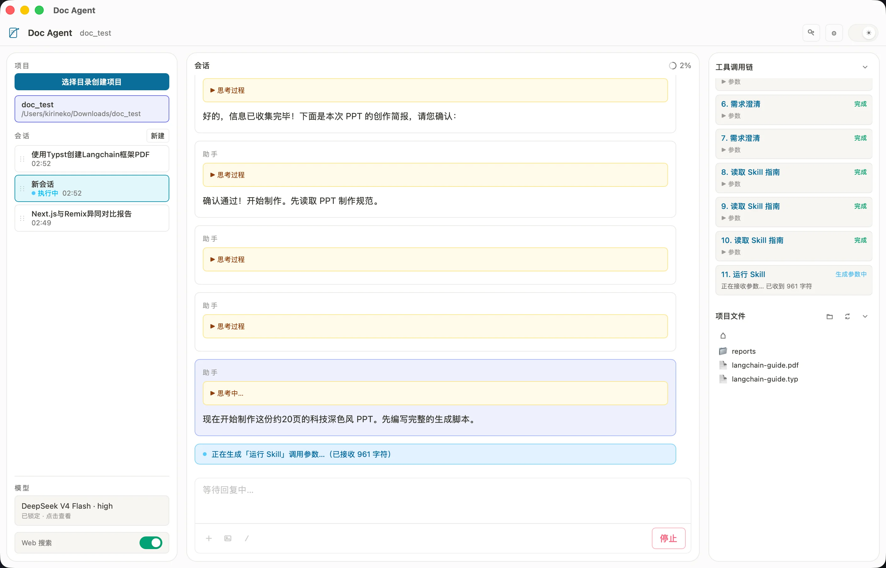

# Doc Agent

面向办公场景的本地 AI 助手。以**项目文件夹**为工作边界，在 Word、Excel、PPT、PDF 等文档上通过对话完成阅读、分析、改写与生成。数据与 API Key 均保存在本机，文档文件不离开你选择的目录。

**文档站点**：[docs.kirineko.tech](https://docs.kirineko.tech/) — 安装指南、功能说明与使用场景

**技术栈**：Tauri 2 · Rust · React

**支持平台**：Windows（x86_64）· macOS（Apple Silicon / aarch64）



---

## 主要功能

### 项目与会话

- 选择一个本地文件夹作为**项目**，Agent 只能在该目录内读写文件
- 每个项目可创建多个**独立会话**，历史消息与工具调用记录保存在本机
- 最多 **3 个会话**可同时运行（可跨项目）；同时写同一文件时会提示占用
- 左侧以「项目 → 会话」树管理导航；顶栏「**密钥与服务**」配置各模型与搜索 API Key
- 输入区上方选择模型与思考强度；新建会话默认沿用上次选择
- 可在项目根放置 `AGENTS.md` 作为项目说明；`/init` 可引导生成或更新

### 对话与界面

- **三栏布局**：左侧项目与会话 · 中间对话 · 右侧 Inspector（项目文件 / 工具调用链 / 构建产物），栏宽可拖拽
- 明暗主题；流式 Markdown（代码高亮、表格、公式）；思考过程默认折叠
- 多轮工具调用时，每一步回复独立展示
- 输入区支持导入文件、图片附件、斜杠命令，以及 `@` 引用项目内文件
- 可粘贴或选择图片（PNG / JPEG / WebP / GIF）；执行中可停止当前回合
- 上下文接近上限时自动压缩；`/compact` 可手动压缩
- 空会话可生成起步问题，每轮结束后提供后续提问（需配置 DeepSeek Key）
- 需求不清晰时会暂停澄清，确认后再继续
- 模型服务出错时，对话区展示独立错误卡片（可复制详情）；短暂网络波动会自动重试

### 支持的模型

新建会话可选：

| 模型 | 提供商 | 视觉 | 思考模式 | 思考强度 |
|------|--------|------|----------|----------|
| DeepSeek Flash | DeepSeek | ✓ | 可开关 | low / high / max |
| MiMo v2.5 | MiMo | ✓ | 可开关 | — |
| MiMo v2.5 Pro | MiMo | — | 可开关 | — |
| Kimi K3 | Kimi | ✓ | 始终开启 | low / high / max |
| Gemini 3.8 Flash | Google | ✓ | 始终开启 | low / medium / high |
| GLM-5.3-Flash | 智谱 | ✓ | 始终开启 | low / high / max |

历史会话中的 DeepSeek V4 Pro、Kimi K2.6 仍可续聊。MiMo v2.5 Pro Ultraspeed 为只读，请新建会话并改用 MiMo v2.5 Pro。

在顶栏「**密钥与服务**」配置 API Key，在输入区上方选择模型。Gemini 会跟随系统代理或 VPN。可选配置 Tavily 并在侧栏开启 Web 搜索。

### 文档与工具能力

Agent 可在项目目录内完成：

| 类别 | 能力 |
|------|------|
| 文件 | 列出、读取、写入、搜索；右侧浏览项目文件 |
| 图片 | 对话中粘贴图片；识别项目内图片；将网络图片下载到项目目录 |
| Office 阅读 | 将 Word / Excel / PPT / PDF 转为可读文本 |
| Word / Excel / PPT | 创建与编辑；旧版 `.doc` / `.xls` / `.ppt` 可转换 |
| PDF | 合并、拆分、旋转、删页；文本与识图阅读 |
| 网页与排版 | Markdown 转幻灯片 / 报告 / 简历网页；Typst 离线编译 PDF |
| 数据分析 | 表格提取、SQL 查询、公式重算 |
| 联网（可选） | 搜索与网页摘录（需 Tavily Key） |

所有文件操作限定在你选择的项目文件夹内。

---

## 数据存储

应用数据保存在系统应用数据目录（与安装包位置无关）：

| 内容 | macOS | Windows |
|------|-------|---------|
| 会话 / 项目元数据（SQLite） | `~/Library/Application Support/com.kirineko.doc-agent/doc_agent.db` | `%APPDATA%\com.kirineko.doc-agent\doc_agent.db` |
| API Key（`config.toml`） | 同上目录 | 同上目录 |
| 模型服务错误日志 | `~/Library/Application Support/com.kirineko.doc-agent/logs/provider-errors.jsonl` | `%APPDATA%\com.kirineko.doc-agent\logs\provider-errors.jsonl` |
| **文档文件** | 创建项目时选择的文件夹 | 同左 |

项目内临时文件（附件、脚本缓存、PDF 渲染页等）在 **`.cache/`** 下，不出现在文件浏览中。

---

## 安装

版本变更见 [CHANGELOG.md](./CHANGELOG.md)。

请从 [GitHub Releases](https://github.com/kirineko/doc_agent/releases) 下载对应平台的安装包（macOS：`.dmg`；Windows：NSIS `*-setup.exe`）。Release 说明中提供阿里云 OSS 下载链接。

### 自动更新

从 **1.0.0** 起，应用支持应用内自动更新（启动时检查 + 设置抽屉「更新」）。**1.0.0 之前**的版本不含 updater，需手动安装 1.0.0 基线包。

> 暂不提供 Linux 安装包。

---

## 快速开始

详细图文步骤见 [文档站 · 新手配置](https://docs.kirineko.tech/#setup)。

1. 安装并启动 Doc Agent
2. 在左侧添加项目，选择你的工作文件夹
3. 在顶栏打开「**密钥与服务**」，配置要用的模型 API Key
4. 在输入区上方选择模型（需要识图时选带「视觉」的型号），新建会话即可开始对话
5. 可以试试：「列出目录里的 Word 文件」「总结 @某文件.docx 的要点」「把这几张网络图片下载到 images/ 再插入 Word」

**快捷键**：`Enter` 发送 · `Shift+Enter` 换行 · `@` 引用文件 · `/` 斜杠命令 · 粘贴图片（视觉模型）

---

## 从源码构建

**环境要求**：Node.js 22+ · Rust stable · 各平台 Tauri 前置依赖（见 [Tauri 文档](https://v2.tauri.app/start/prerequisites/)）

```bash
npm ci
npm run bundle:js    # 打包 skill 运行时 JS 库（构建前必须执行）
npm run tauri dev    # 开发模式
```

首次 Rust 编译会通过 `build.rs` 自动下载 **PDFium** 与 **Noto SC 字体**（约 40 MB，缓存于 `src-tauri/fonts/`）。需联网；离线复用请保留该目录。

**测试**

```bash
cd src-tauri && cargo fmt --check && cargo clippy -- -D warnings && cargo test
npm run typecheck && npm test
```

**本地打 release 包**

```bash
npm run bundle:js
npm run tauri build
```

---

## 发版说明（维护者）

- **CI**：仅 `pull_request → main` 触发测试门禁；push main **不**触发构建；缓存 `src-tauri/fonts/` 以减少 Noto 重复下载
- **Release**：推送纯数字三段 CalVer tag（`YYYY.M.D`，**无 `v` 前缀**）时触发 Windows（NSIS）/ macOS（DMG）安装包构建，产物上传 **阿里云 OSS** 并同步 **GitHub Release**（Windows 不产出 MSI：CalVer 与 WiX major ≤255 不兼容）
- **版本格式（CalVer）**：**`YYYY.M.D`**（年.月.日），**禁止前导零** — 例：`2026.6.14`（✅）、`2026.06.14`（❌）
- **取当日版本**：`npm run calver:today`
- **发版前**：`package.json`、`src-tauri/Cargo.toml`、`src-tauri/tauri.conf.json` 的 `version` 与 tag 完全一致；更新 `CHANGELOG.md`（`[Unreleased]` → 正式版本节）；**打 tag 前必须跑通发版自检**：

  ```bash
  npm run release:check
  ```

  先提交本次代码、版本文件（含两个 lockfile）和 CHANGELOG，确认工作区干净，再打 tag 与推送。tag 指向提交，不会包含未提交的更改；以下命令应在已完成发版提交的 `main` 上执行：

  ```bash
  VERSION=$(npm run -s calver:today)
  test -z "$(git status --porcelain)" || exit 1
  test "$(node -p 'JSON.parse(require("fs").readFileSync("package.json", "utf8")).version')" = "$VERSION" || exit 1
  git tag "$VERSION"
  git push --atomic origin main "$VERSION"
  ```

- tag **不要**加 `v` 前缀；细则见 `openspec/specs/project-versioning/spec.md`
- **Updater endpoint**：`https://doc-agent.oss-cn-guangzhou.aliyuncs.com/latest.json`
- **GitHub Secrets**：`TAURI_SIGNING_PRIVATE_KEY`、`TAURI_SIGNING_PRIVATE_KEY_PASSWORD`（可选）、`ALIYUN_ACCESS_KEY_ID`、`ALIYUN_ACCESS_KEY_SECRET`、`OSS_BUCKET`、`OSS_REGION`
- **publish 失败应急**：Actions 手动跑 `Release`，`publish_only=true` + `source_run_id`（成功 build 的 run id）+ `version`（勿用 Re-run failed jobs）

---

## 许可证

见仓库 LICENSE（如有）。
