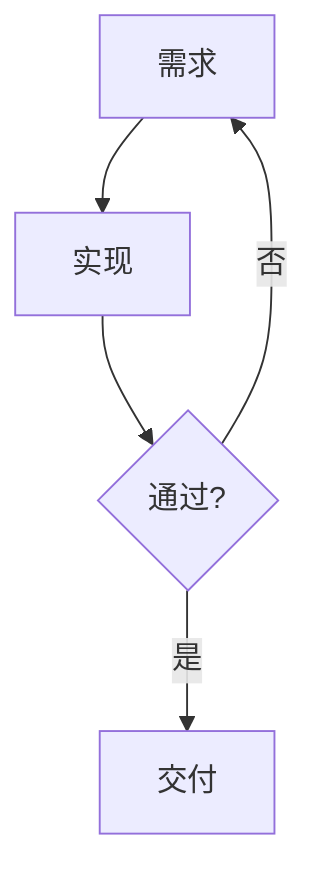

# Markdown HTML Skill

将项目内的 `.md` 转为**离线静态 HTML**，支持三种交付形态：**slide（幻灯片）**、**report（报告）**、**resume（简历）**。

## 工具分工

| 任务 | 工具 | 说明 |
|------|------|------|
| 列出模板 | `markdown_list_templates` | 查看 slide/report/resume 内置模板 id |
| 读取示例 | `markdown_read_template` | 获取含 frontmatter 的示例 Markdown |
| 转换 HTML | `markdown_to_html` | 读取 `.md`，按 profile + template 输出 HTML |
| 导出 PDF（可选） | `html_to_pdf` | 对已有 HTML 单独导出，非本 skill 必做步骤 |

## 与 html-report / pptx 的分工

- **html-report**：自由 HTML/CSS/JS，表格图表、复杂交互 → `fs_write` 手写
- **markdown（本 skill）**：已有 Markdown 源，要 slide/report/resume 模板化网页 → `markdown_to_html`
- **pptx**：可编辑 `.pptx` 交付 → pptx skill + `skill_run`

## 工作流（新建文档）

1. `skill_read markdown`（每会话一次）
2. `markdown_list_templates` → 选 profile 与 template
3. `markdown_read_template` → 复制示例 frontmatter 与结构
4. `fs_write` 写入/修改 `.md`
5. `markdown_to_html` 生成 HTML

```json
{"tool": "markdown_to_html", "args": {
  "path": "docs/deck.md",
  "out_path": "docs/deck/index.html",
  "profile": "slide",
  "template": "slide/gaia"
}}
```

## Profile 选型

| profile | 适用场景 | 输出形态 |
|---------|----------|----------|
| `slide` | 演示、培训、路演 | 单页 `index.html` 或指定 `.html`，`---` 分页 |
| `report` | 技术报告、季度总结 | 目录 + `assets/`（主题、高亮、KaTeX、Mermaid 按需） |
| `resume` | 个人简历 | 同 report，简历模板布局 |

## 模板速选

| profile | 默认 | 备选与场景 |
|---------|------|-----------|
| slide | `slide/default` | `gaia` 柔和渐变 / `uncover` 深色路演 / `corporate` 商务 / `academic` 学术 serif / `minimal-dark` 代码演示 |
| report | `report/github-light` | `github-dark` 深色 / `academic` 论文 / `business` 商务封面 / `narrow` 窄栏长文 / `data` 多表数据 |
| resume | `resume/classic` | `modern` 深色页眉 / `two-col` 双栏 / `compact` 一页紧凑 / `even` 均分双栏 |

## Frontmatter（YAML）

### report

```yaml
---
title: 季度业务报告
author: 数据分析组
date: 2026-06-26
---
```

### resume

```yaml
---
name: 张三
title: 高级前端工程师
email: zhangsan@example.com
phone: 138-0000-0000
location: 上海
---
```

封面由 frontmatter 生成：`name` 为主标题、`title` 为职位副标题、`email`/`phone`/`location`（及可选 `website`/`github`）聚合为联系行。**正文请勿再写 `# 姓名` 或重复职位行**；正文从 `## 章节`（技能 / 经历 / 教育）开始。

### slide（Marp directives，可选）

```yaml
---
marp: true
theme: gaia
paginate: true
title: 产品发布
---
```

## options 参数

| 字段 | 默认 | 说明 |
|------|------|------|
| `toc` | true | report 自动生成 h2/h3 目录 |
| `math` | true | KaTeX 数学（浏览器端渲染） |
| `highlight` | true | 代码块语法高亮 |
| `mermaid` | true | Mermaid 图表（按需拷贝资源） |
| `lang` | zh-CN | HTML `lang` 属性 |

## 内容增强写法

### Mermaid 流程图

````markdown

````

- Mermaid 代码块在浏览器端离线渲染为图
- **紧跟其后**的「图：…」/「Figure …」段落自动居中作为图注

### 数学公式（KaTeX）

- 行内：`$E = mc^2$`
- 独立：`$$\int_0^1 x^2\,dx$$`

### 表格与链接

- 标准 GFM 表格即可，宽表自动包裹横向滚动容器
- 正文外链 `[文字](https://…)` 允许保留；**优先**使用本地资源（`./assets/…` 或项目内图片路径），离线打开更可靠

### 插图与图注

````markdown

*图注：居中显示的说明文字*
````

- 图片路径**相对 `.md` 源文件**书写即可；`markdown_to_html` 会按 `out_path` 自动换算为 HTML 可加载的相对路径
- 若图片在项目根 `images/`，而 `.md` 在子目录，可写 `../images/xxx.jpg`；若写 `images/xxx.jpg` 且文件在项目根，转换时也会尝试从项目根解析
- 图注：图片下一行用 `*斜体*` 或「图：…」/「Figure …」段落；转换时会包成 `<figure><figcaption>` 并居中
- 外链图片 `` 可保留，但离线打开需联网；需要离线时请先用 `image_download` 落地到项目内

## 落盘规则

- 产物 MUST 写在**项目根目录**内
- **禁止**写入 `.cache/skill-run/`
- 工具内置 JS/CSS 走 **本地相对路径**（`./assets/...`）；正文中的外链按需保留，但离线场景优先本地资源
- 无 mermaid 语法块时不写入 mermaid 资源；关闭 `options.mermaid` 同理

## 输入规模

- Markdown 上限 **512KB**；slide 页数上限 **200**（按 `---` 计）。超限请拆分。
